# Media Pipeline Architecture

Comprehensive architecture documentation with detailed diagrams.

## Table of Contents

- [System Overview](#system-overview)
- [Module Architecture](#module-architecture)
- [Data Flow](#data-flow)
- [Operator System](#operator-system)
- [Planner Architecture](#planner-architecture)
- [Executor Architecture](#executor-architecture)
- [API Layer](#api-layer)
- [Future Distributed Architecture](#future-distributed-architecture)

## System Overview

### High-Level Architecture

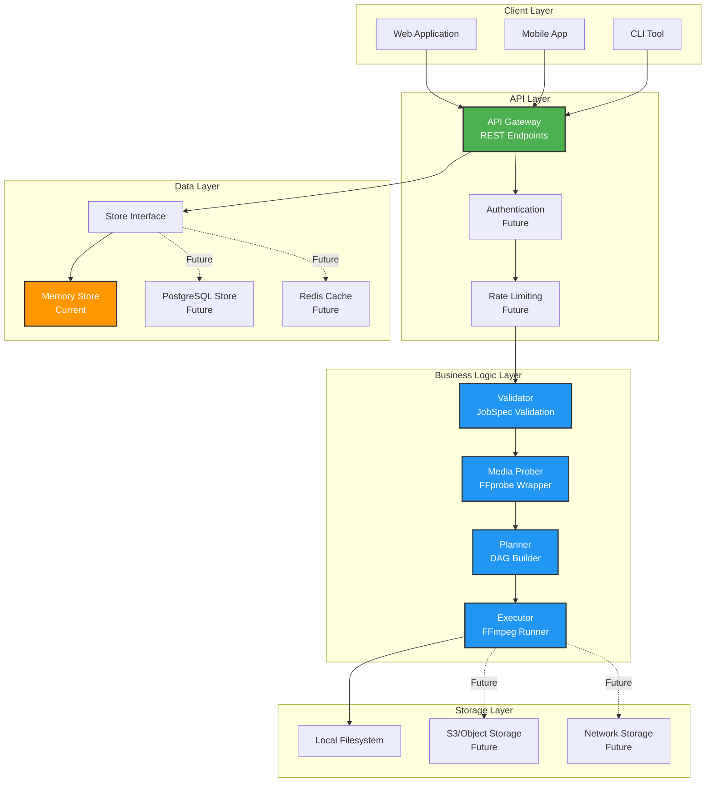

## Module Architecture

### Core Modules

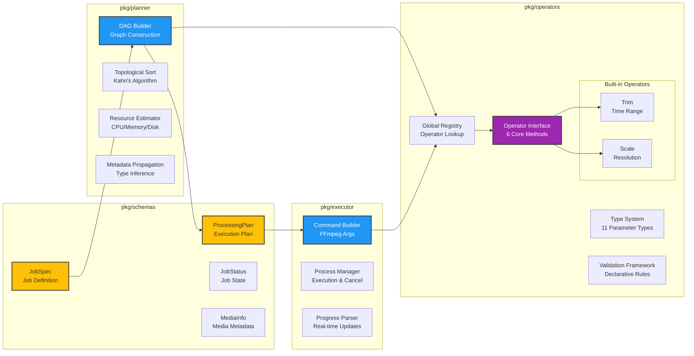

## Data Flow

### Job Processing Data Flow

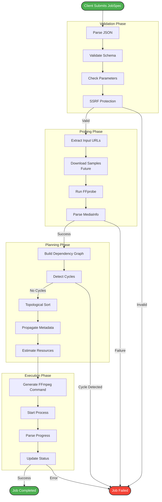

### Store Data Model

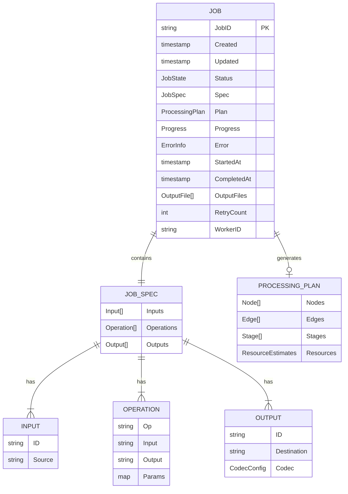

## Operator System

### Operator Lifecycle

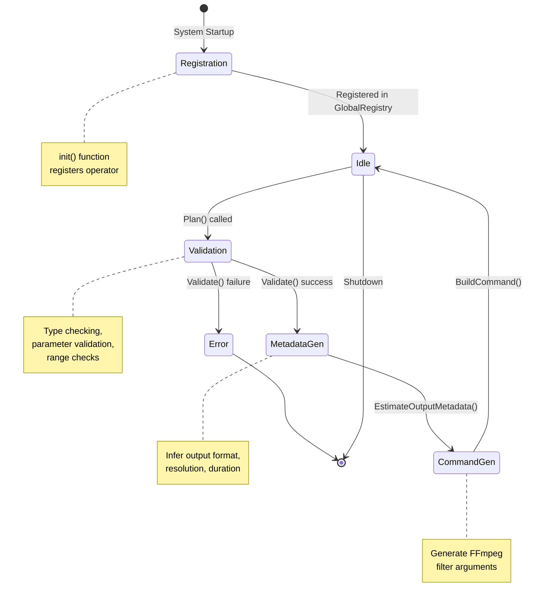

### Type System

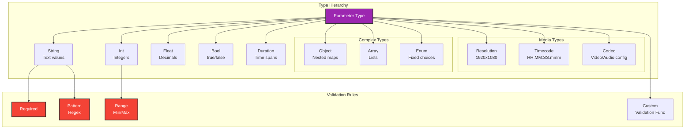

### Built-in Operators

```mermaid
graph LR
    subgraph "Input Operators"
        Download[Download<br/>Future]
        Probe[Probe<br/>Metadata]
    end

    subgraph "Transform Operators"
        Trim[Trim<br/>✅ Implemented]
        Scale[Scale<br/>✅ Implemented]
        Loudnorm[Loudnorm<br/>Future]
        Mix[Mix Audio<br/>Future]
        Overlay[Overlay Video<br/>Future]
        Concat[Concatenate<br/>Future]
    end

    subgraph "Output Operators"
        Encode[Encode<br/>Codec Config]
        Upload[Upload<br/>S3/GCS Future]
    end

    Input[Input Media] --> Download
    Download --> Probe
    Probe --> Trim
    Trim --> Scale
    Scale --> Loudnorm
    Loudnorm --> Mix
    Mix --> Overlay
    Overlay --> Concat
    Concat --> Encode
    Encode --> Upload
    Upload --> Output[Output Media]

    style Trim fill:#4CAF50,stroke:#333,stroke-width:2px,color:#fff
    style Scale fill:#4CAF50,stroke:#333,stroke-width:2px,color:#fff
    style Loudnorm fill:#9E9E9E,stroke:#333,stroke-width:2px
    style Mix fill:#9E9E9E,stroke:#333,stroke-width:2px
    style Overlay fill:#9E9E9E,stroke:#333,stroke-width:2px
    style Concat fill:#9E9E9E,stroke:#333,stroke-width:2px
```

## Planner Architecture

### DAG Construction Process

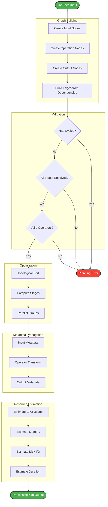

### Execution Stages

```mermaid
gantt
    title Parallel Execution Stages
    dateFormat  X
    axisFormat %s

    section Stage 0
    Input Node 1    :0, 10
    Input Node 2    :0, 10

    section Stage 1
    Trim Operation  :10, 30

    section Stage 2
    Scale Operation :40, 50

    section Stage 3
    Encode Output 1 :90, 110
    Encode Output 2 :90, 110

    section Dependencies
    Stage 1 waits for Stage 0 :crit, 10, 0
    Stage 2 waits for Stage 1 :crit, 40, 0
    Stage 3 waits for Stage 2 :crit, 90, 0
```

## Executor Architecture

### FFmpeg Execution Flow

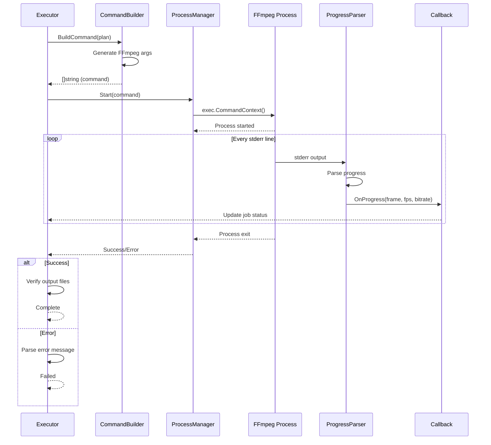

### Command Builder

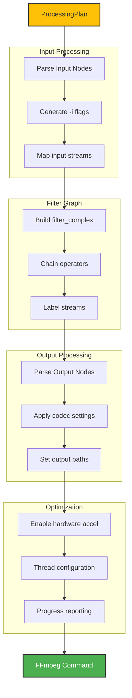

## API Layer

### API Request Flow

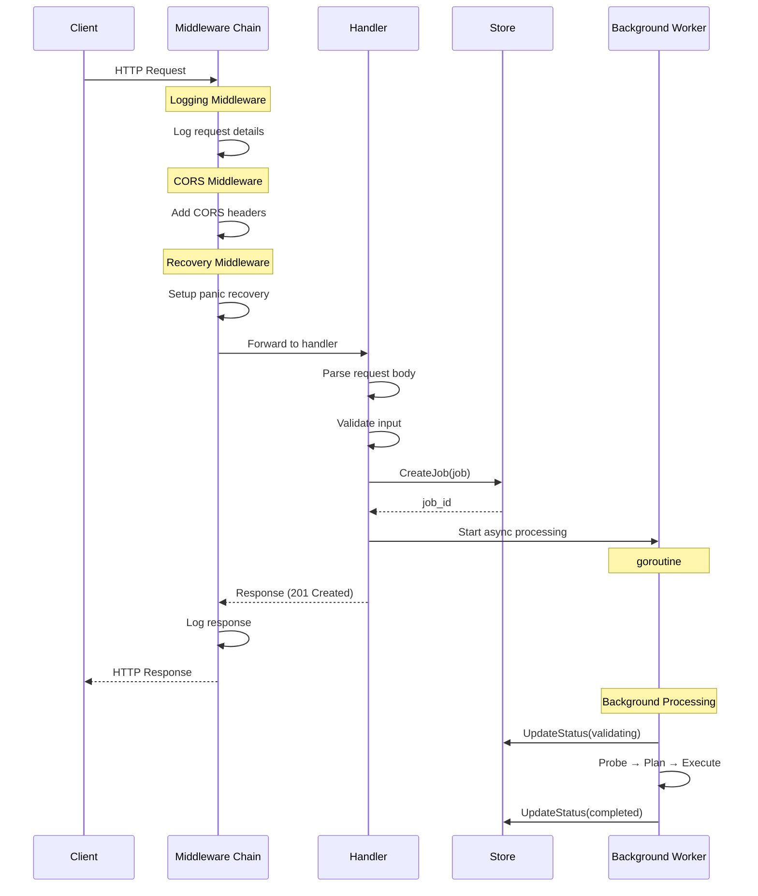

### Middleware Chain

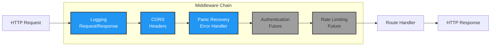

## Future Distributed Architecture

### Worker Pool Architecture

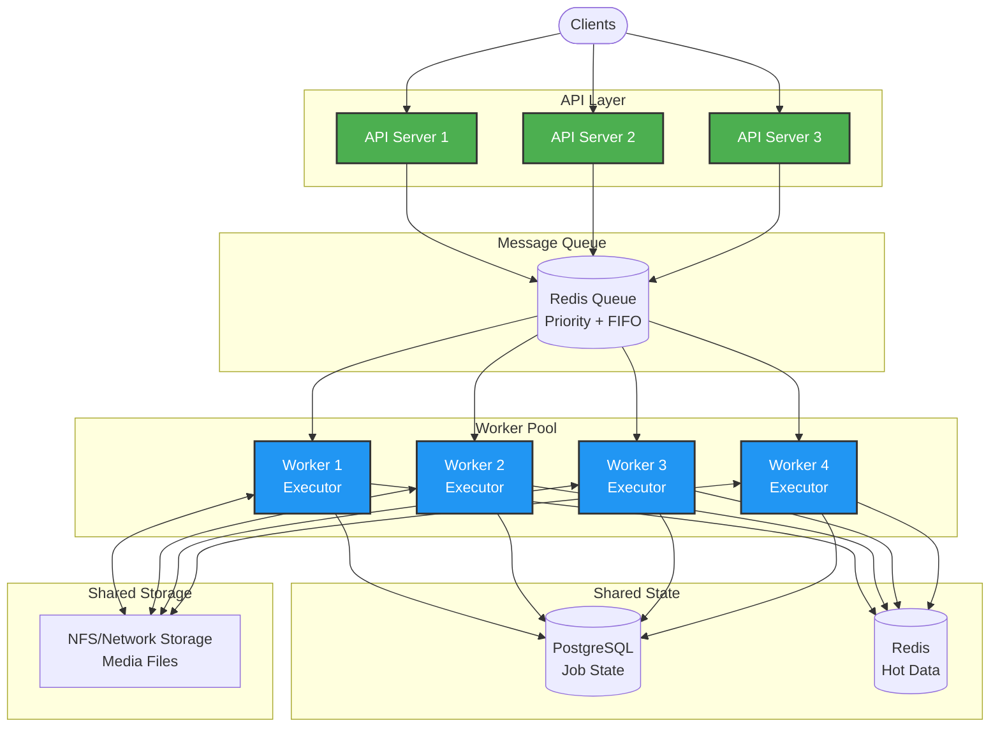

### Horizontal Scaling Strategy

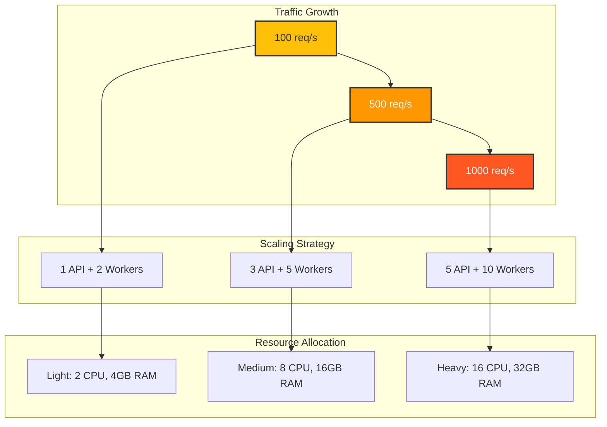

## Technology Stack

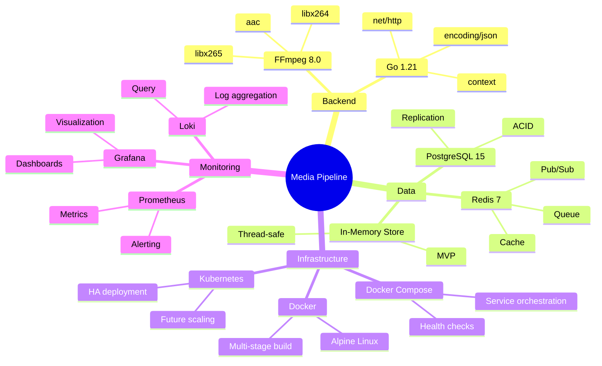

---

**Document Version**: 1.0
**Last Updated**: 2024-12-22
**Status**: Production Ready
