# Media Pipeline 架构文档

完整的架构文档与详细图表。

## 目录

- [系统概览](#系统概览)
- [模块架构](#模块架构)
- [数据流](#数据流)
- [算子系统](#算子系统)
- [规划器架构](#规划器架构)
- [执行器架构](#执行器架构)
- [API 层](#api-层)
- [未来分布式架构](#未来分布式架构)

## 系统概览

### 高层架构

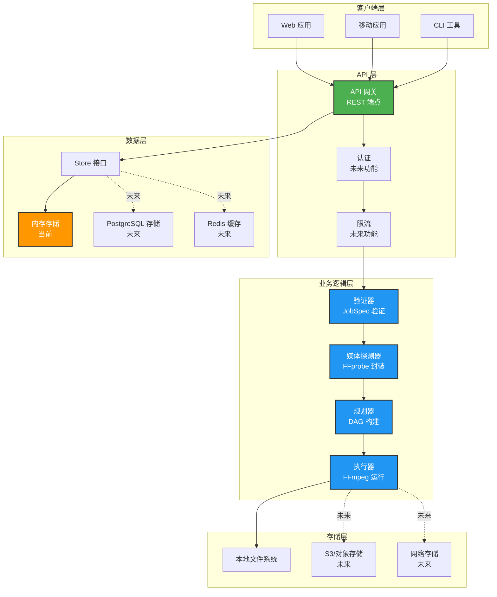

## 模块架构

### 核心模块

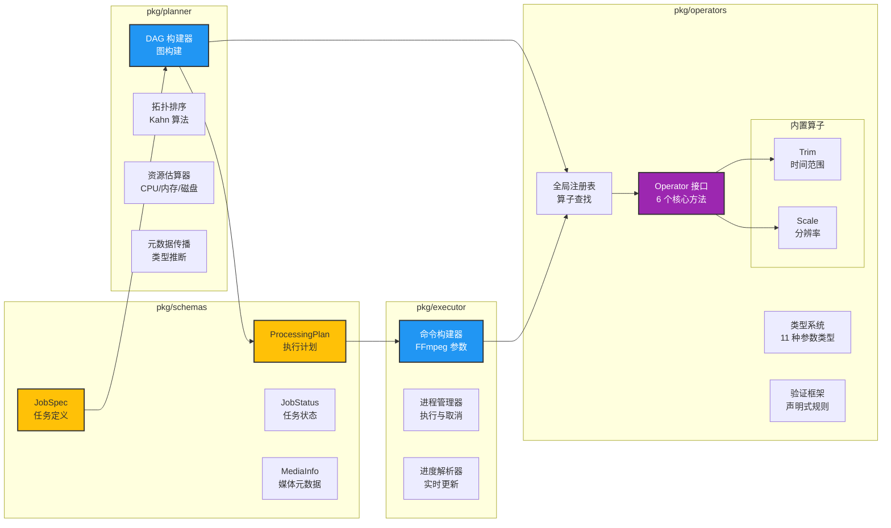

## 数据流

### 任务处理数据流

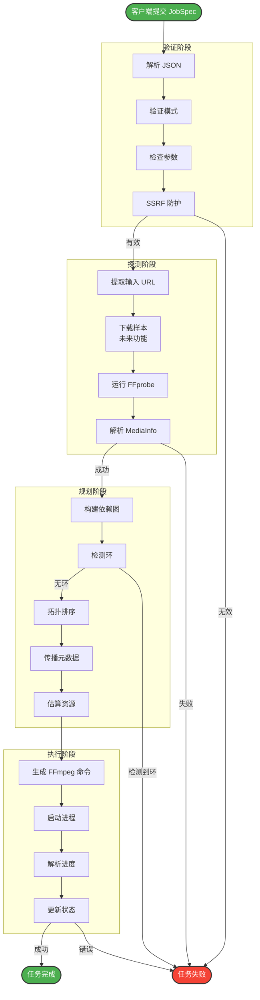

### Store 数据模型

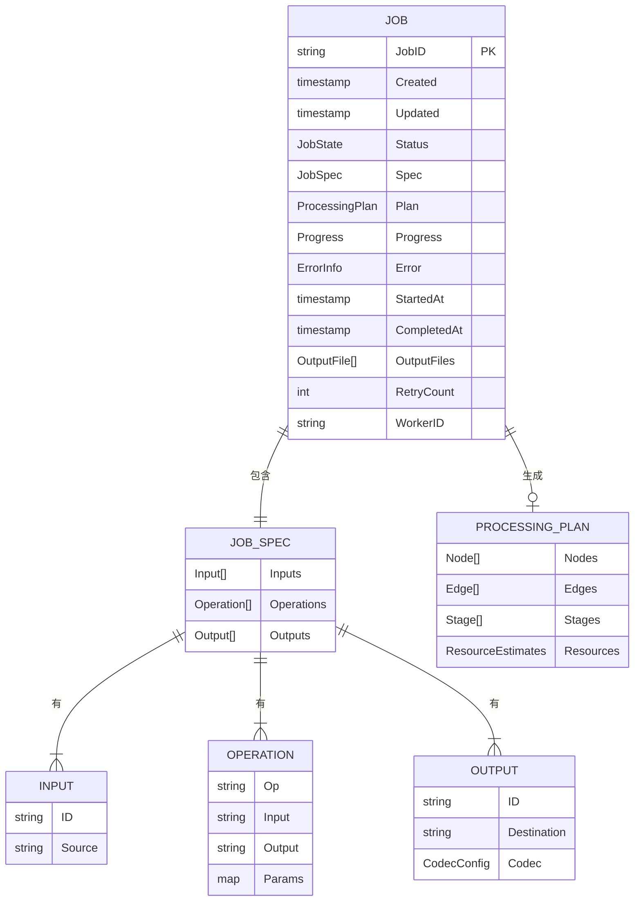

## 算子系统

### 算子生命周期

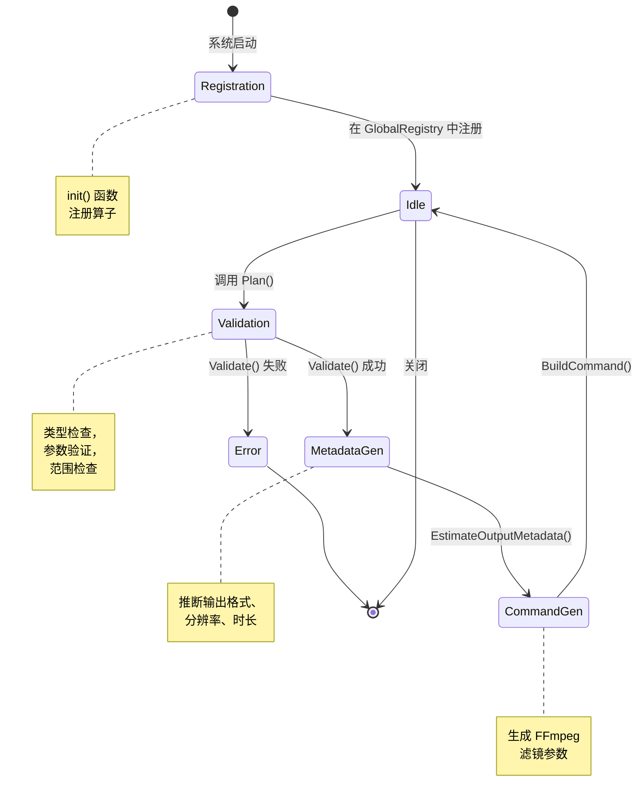

### 类型系统

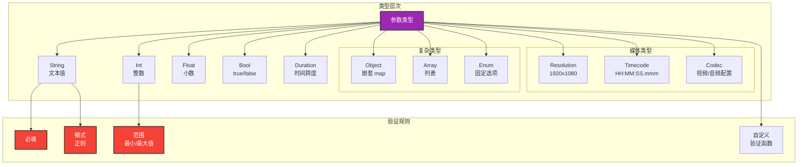

### 内置算子

```mermaid
graph LR
    subgraph "输入算子"
        Download[Download<br/>未来]
        Probe[Probe<br/>元数据]
    end

    subgraph "变换算子"
        Trim[Trim<br/>✅ 已实现]
        Scale[Scale<br/>✅ 已实现]
        Loudnorm[Loudnorm<br/>未来]
        Mix[Mix 音频<br/>未来]
        Overlay[Overlay 视频<br/>未来]
        Concat[拼接<br/>未来]
    end

    subgraph "输出算子"
        Encode[编码<br/>编解码器配置]
        Upload[上传<br/>S3/GCS 未来]
    end

    Input[输入媒体] --> Download
    Download --> Probe
    Probe --> Trim
    Trim --> Scale
    Scale --> Loudnorm
    Loudnorm --> Mix
    Mix --> Overlay
    Overlay --> Concat
    Concat --> Encode
    Encode --> Upload
    Upload --> Output[输出媒体]

    style Trim fill:#4CAF50,stroke:#333,stroke-width:2px,color:#fff
    style Scale fill:#4CAF50,stroke:#333,stroke-width:2px,color:#fff
    style Loudnorm fill:#9E9E9E,stroke:#333,stroke-width:2px
    style Mix fill:#9E9E9E,stroke:#333,stroke-width:2px
    style Overlay fill:#9E9E9E,stroke:#333,stroke-width:2px
    style Concat fill:#9E9E9E,stroke:#333,stroke-width:2px
```

## 规划器架构

### DAG 构建过程

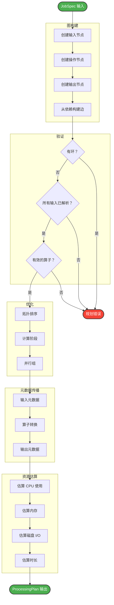

### 执行阶段

```mermaid
gantt
    title 并行执行阶段
    dateFormat  X
    axisFormat %s

    section 阶段 0
    输入节点 1    :0, 10
    输入节点 2    :0, 10

    section 阶段 1
    Trim 操作  :10, 30

    section 阶段 2
    Scale 操作 :40, 50

    section 阶段 3
    编码输出 1 :90, 110
    编码输出 2 :90, 110

    section 依赖关系
    阶段 1 等待阶段 0 :crit, 10, 0
    阶段 2 等待阶段 1 :crit, 40, 0
    阶段 3 等待阶段 2 :crit, 90, 0
```

## 执行器架构

### FFmpeg 执行流程

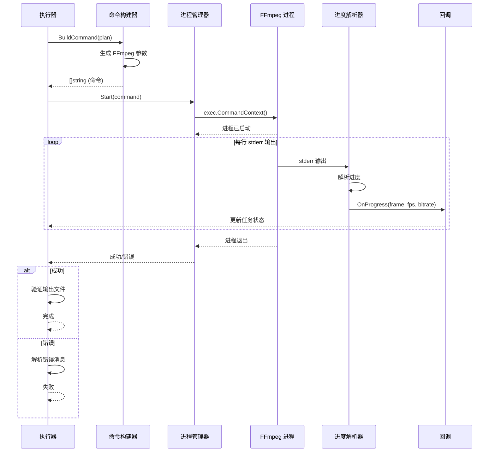

## API 层

### API 请求流程

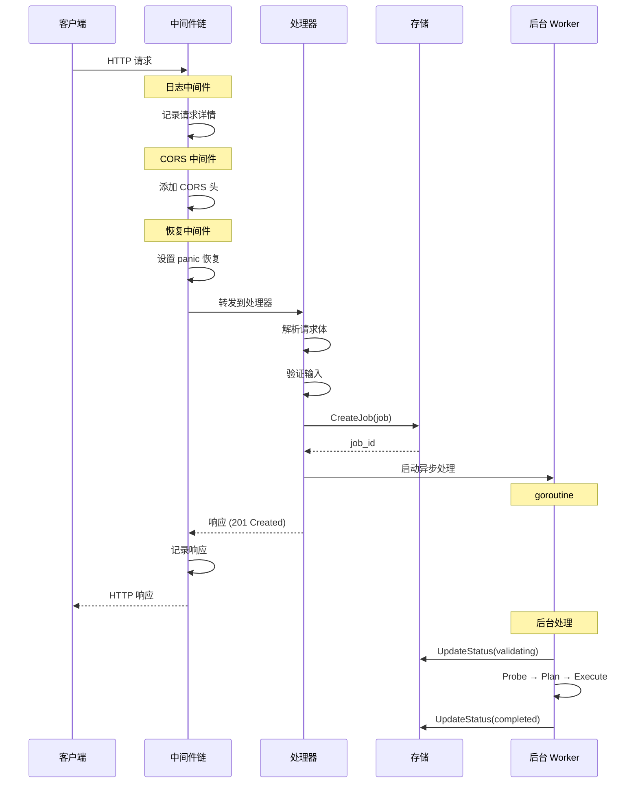

### 中间件链

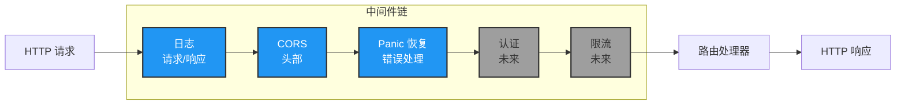

## 未来分布式架构

### Worker 池架构

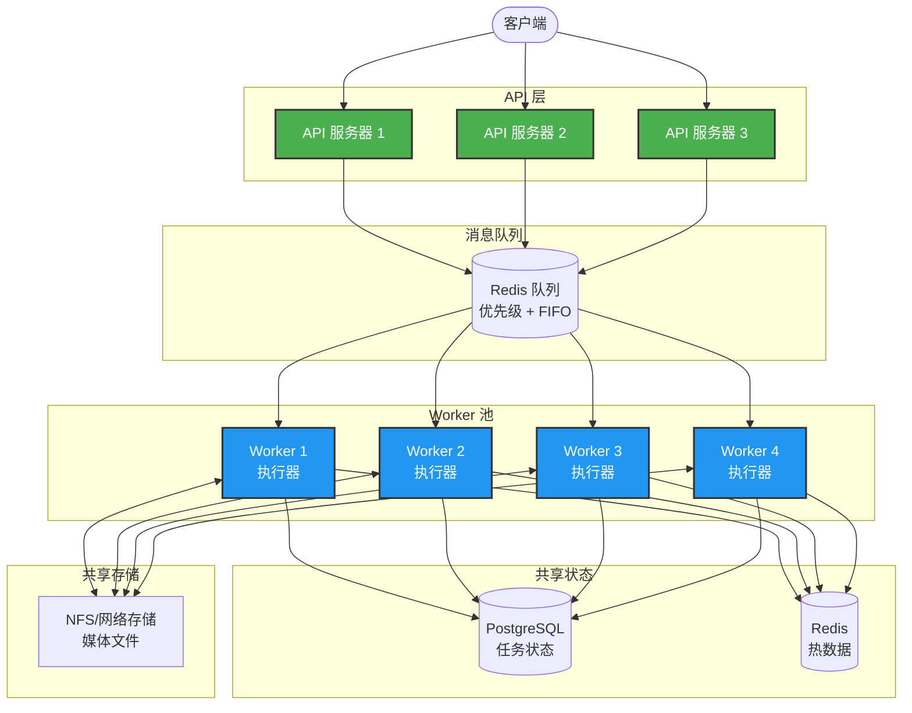

### 横向扩展策略

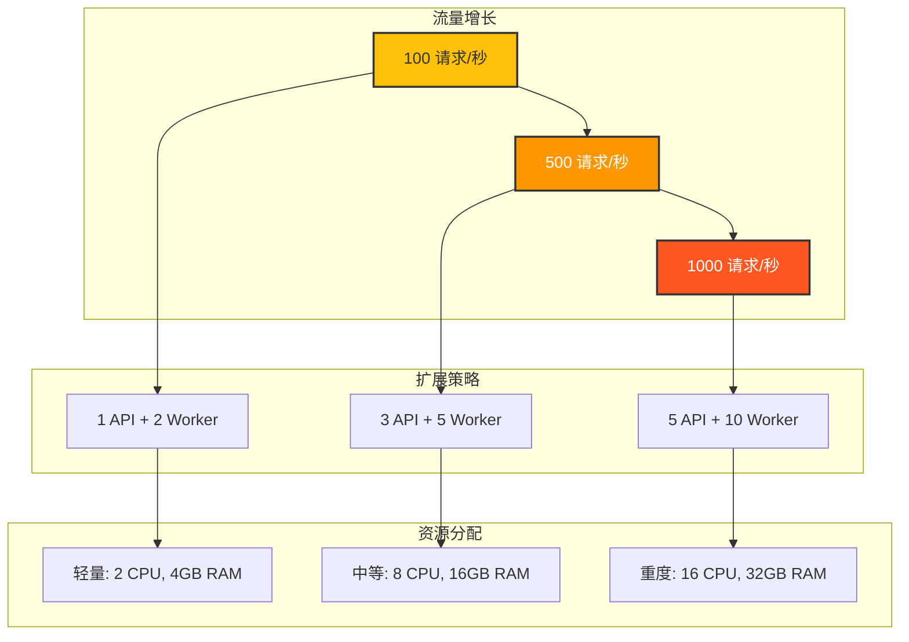

## 技术栈

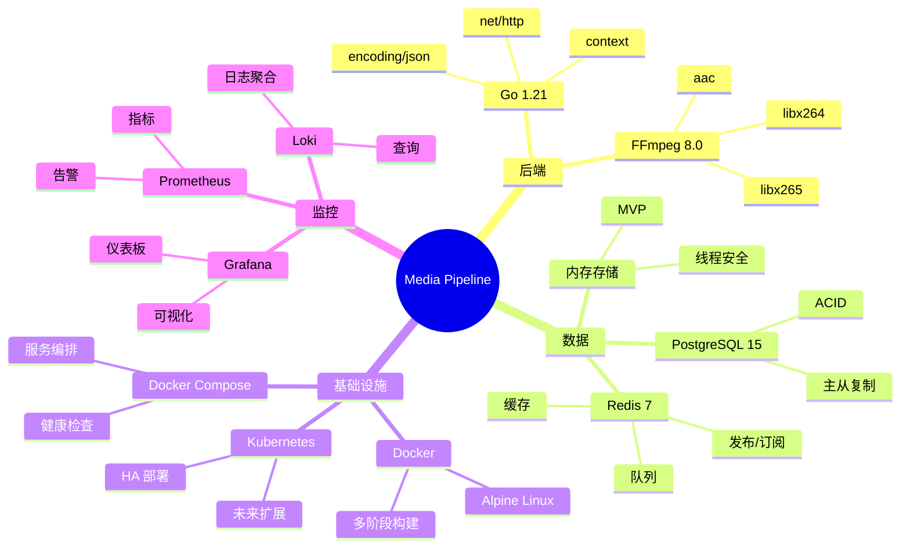

---

**文档版本**: 1.0
**最后更新**: 2024-12-22
**状态**: 生产就绪
