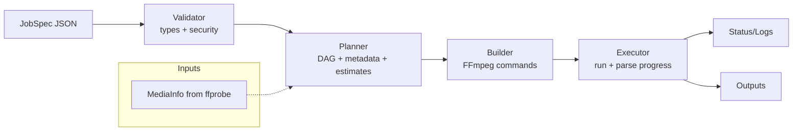

# Implementation Guide

This guide provides a roadmap for completing the media-pipeline implementation.

**Last Updated**: 2025-12-16

## Phase 1: Core Engine ✅ COMPLETED

### 1.1 Schemas Package ✅
**Status**: Complete
**Files**: `pkg/schemas/*.go`

Implemented:
- `Duration` type with multi-format parsing (Go duration, timecode, ISO 8601)
- `JobSpec` structure (inputs, operations, outputs)
- `ProcessingPlan` structure (nodes, edges, estimates)
- `JobStatus` structure (progress tracking)
- `MediaInfo` structures (video/audio stream metadata)

### 1.2 Operators Package ✅
**Status**: Complete
**Files**: `pkg/operators/*.go`

Implemented:
- `Operator` interface (6 core methods)
- Type system (11 parameter types)
- Parameter validation framework
- Type converter (automatic type conversion)
- Registry mechanism (global operator registration)

### 1.3 Built-in Operators ✅
**Status**: 2 operators implemented
**Files**: `pkg/operators/builtin/*.go`

Implemented:
- `trim` - Trim video/audio to time range
- `scale` - Scale video resolution with algorithm selection

### 1.4 Planner Module ✅
**Status**: Complete
**Files**: `pkg/planner/*.go`

Implemented:
- DAG construction with cycle detection (`graph.go`)
- Topological sorting and execution stages (`sort.go`)
- Metadata propagation (`metadata.go`)
- Resource estimation (`estimator.go`)
- Integrated planner (`planner.go`) with tests

### 1.5 Executor Module ✅
**Status**: Complete
**Files**: `pkg/executor/*.go`

Implemented:
- FFmpeg command builder from ProcessingPlan (`builder.go`)
- Process execution with cancellation (`executor.go`)
- Real-time progress parsing (`progress.go`)
- Comprehensive tests

### Core Compilation Flow



## Phase 2: Media Probing 📋 TODO

### 2.1 Media Prober 📋 TODO
**Priority**: High
**Target**: `pkg/prober/`

Tasks:
1. **FFprobe Wrapper** (`prober/ffprobe.go`)
   - Execute ffprobe on input files
   - Parse JSON output to MediaInfo
   - Handle remote files (S3, HTTP)

2. **Parallel Probing** (`prober/parallel.go`)
   - Probe multiple inputs concurrently
   - Limit concurrency (max 5 concurrent)

## Phase 3: State Management 📋 TODO

### 3.1 Database Layer 📋 TODO
**Priority**: High
**Target**: `pkg/store/`

Tasks:
1. **PostgreSQL Store** (`store/postgres.go`)
   - Jobs table CRUD operations
   - Job logs table
   - Workers table
   - Execution steps table
   - State transitions with transactions

2. **Redis Store** (`store/redis.go`)
   - Job queue (sorted sets)
   - Distributed locks
   - Caching

3. **State Machine** (`store/statemachine.go`)
   - State transition validation
   - Allowed transitions map
   - Atomic state updates

**Reference**: `docs/plans/distributed-state-management-design.md`

### 3.2 Job Queue 📋 TODO
**Priority**: High
**Target**: `pkg/queue/`

Tasks:
1. **Priority Queue** (`queue/queue.go`)
   - Redis sorted sets implementation
   - Enqueue with priority
   - Dequeue (pop min score)
   - Peek without removing

### 3.3 Distributed Locks 📋 TODO
**Priority**: Medium
**Target**: `pkg/lock/`

Tasks:
1. **Distributed Lock** (`lock/lock.go`)
   - Redis SET NX EX implementation
   - Keep-alive mechanism
   - Safe release (Lua script)

## Phase 4: Error Handling 📋 TODO

### 4.1 Error System 📋 TODO
**Priority**: High
**Target**: `pkg/errors/`

Tasks:
1. **Error Types** (`errors/errors.go`)
   - ProcessingError structure
   - Error codes (50+ codes)
   - Error metadata

2. **FFmpeg Parser** (`errors/ffmpeg.go`)
   - Pattern-based error parsing
   - 15+ common error patterns
   - Suggestion generation

3. **Retry Strategy** (`errors/retry.go`)
   - Retry decision logic
   - Exponential backoff
   - Circuit breaker

**Reference**: `docs/plans/error-handling-design.md`

## Phase 5: API Layer 📋 TODO

### 5.1 HTTP API 📋 TODO
**Priority**: High
**Target**: `pkg/api/`

Tasks:
1. **Handlers** (`api/handlers/`)
   - `POST /v1/jobs` - Create job
   - `GET /v1/jobs/{id}` - Get status
   - `GET /v1/jobs` - List jobs
   - `DELETE /v1/jobs/{id}` - Cancel job
   - `GET /v1/jobs/{id}/logs` - Get logs
   - `GET /v1/jobs/{id}/plan` - Get plan
   - `GET /v1/operators` - List operators
   - `GET /v1/operators/{name}` - Operator details

2. **Middleware** (`api/middleware/`)
   - Authentication (API key, JWT)
   - Rate limiting (token bucket)
   - Request logging
   - CORS handling

3. **Webhooks** (`api/webhooks/`)
   - Webhook sender
   - HMAC signature
   - Retry logic

**Reference**: `docs/plans/api-interface-design.md`

### 5.2 API Server 📋 TODO
**Priority**: High
**Target**: `cmd/api/`

Tasks:
1. **Main Server** (`cmd/api/main.go`)
   - Initialize dependencies (DB, Redis)
   - Register routes
   - Graceful shutdown
   - Health checks

## Phase 6: Worker Process 📋 TODO

### 6.1 Worker 📋 TODO
**Priority**: High
**Target**: `cmd/worker/`

Tasks:
1. **Worker Process** (`cmd/worker/main.go`)
   - Worker registration
   - Heartbeat loop (10s interval)
   - Job processing loop
   - Graceful shutdown

2. **Job Executor** (`cmd/worker/executor.go`)
   - Job claiming (atomic DB update)
   - Execute phases: validation → planning → download → process → upload
   - Progress updates
   - Error handling

3. **Watchdog** (`cmd/worker/watchdog.go`)
   - Detect stale workers (30s timeout)
   - Recover orphaned jobs
   - Fail jobs exceeding max retries

## Phase 7: Additional Operators 📋 TODO

### 7.1 Audio Operators 📋 TODO
**Target**: `pkg/operators/builtin/`

Operators to implement:
- `loudnorm` - EBU R128 loudness normalization (two-pass)
- `mix` - Audio mixing with ducking
- `volume` - Volume adjustment
- `fade` - Audio fade in/out

### 7.2 Video Operators 📋 TODO
**Target**: `pkg/operators/builtin/`

Operators to implement:
- `crop` - Crop video
- `rotate` - Rotate video
- `fps` - Change frame rate
- `pad` - Add padding

### 7.3 Composition Operators 📋 TODO
**Target**: `pkg/operators/builtin/`

Operators to implement:
- `concat` - Concatenate videos
- `overlay` - Overlay images/text
- `drawtext` - Draw text on video
- `thumbnail` - Generate thumbnails
- `waveform` - Generate audio waveform

## Testing Strategy

### Unit Tests
- All packages should have `*_test.go` files
- Test core logic in isolation
- Mock external dependencies (DB, Redis, S3)

### Integration Tests
- Test full job execution flow
- Use Docker Compose for dependencies
- Test with real media files

### Example Test Structure

```go
func TestTrimOperator(t *testing.T) {
    op := &builtin.TrimOperator{}

    params := map[string]interface{}{
        "start":    "00:00:10",
        "duration": "00:05:00",
    }

    err := op.ValidateParams(params)
    assert.NoError(t, err)

    // Test metadata computation
    input := &schemas.MediaInfo{Duration: 600.0}
    output, err := op.ComputeOutputMetadata(params, []*schemas.MediaInfo{input})
    assert.NoError(t, err)
    assert.Equal(t, 300.0, output.Duration)
}
```

## Development Workflow

1. **Read Design Docs**: Understand the module's design before coding
2. **Write Tests First**: TDD approach for core logic
3. **Implement**: Follow the design spec closely
4. **Test**: Run unit and integration tests
5. **Document**: Add inline comments and examples
6. **Review**: Self-review code quality

## Recommended Implementation Order

1. ✅ Schemas (DONE)
2. ✅ Operators interface (DONE)
3. ✅ Built-in operators: trim, scale (DONE)
4. ✅ Planner module (DONE)
5. ✅ FFmpeg executor (DONE)
6. 📋 Media prober <- NEXT
7. 📋 State management (PostgreSQL + Redis)
8. 📋 Error handling system
9. 📋 API server
10. 📋 Worker process
11. 📋 Additional operators

## Key Dependencies

```bash
go get github.com/google/uuid
go get github.com/lib/pq                    # PostgreSQL driver
go get github.com/redis/go-redis/v9         # Redis client
go get github.com/gorilla/mux               # HTTP router
go get github.com/prometheus/client_golang  # Metrics
go get go.opentelemetry.io/otel            # Tracing
```

## Configuration

Create `internal/config/config.go`:

```go
type Config struct {
    Database DatabaseConfig
    Redis    RedisConfig
    Storage  StorageConfig
    FFmpeg   FFmpegConfig
}

type DatabaseConfig struct {
    Host     string
    Port     int
    Database string
    User     string
    Password string
}

type RedisConfig struct {
    Host     string
    Port     int
    Password string
}
```

## Deployment

### Docker Compose (Development)

```yaml
version: '3.8'
services:
  postgres:
    image: postgres:15
    environment:
      POSTGRES_DB: media_pipeline
      POSTGRES_USER: postgres
      POSTGRES_PASSWORD: postgres
    ports:
      - "5432:5432"

  redis:
    image: redis:7
    ports:
      - "6379:6379"

  api:
    build: .
    command: /app/api
    ports:
      - "8080:8080"
    depends_on:
      - postgres
      - redis

  worker:
    build: .
    command: /app/worker
    depends_on:
      - postgres
      - redis
```

## Success Criteria

A successful implementation should:

1. ✅ Accept JobSpec via REST API
2. ✅ Validate parameters using operator schemas
3. ✅ Build DAG and detect cycles
4. ✅ Estimate resources before execution
5. ✅ Generate FFmpeg commands
6. ✅ Execute jobs on workers
7. ✅ Track progress in real-time
8. ✅ Handle failures and retry
9. ✅ Send webhook notifications
10. ✅ Provide detailed logs and metrics

---

**Current Status**: Core infrastructure complete. Ready to implement Planner module.

**Next Step**: Implement `pkg/planner/` following the design in `docs/plans/planner-detailed-design.md`
