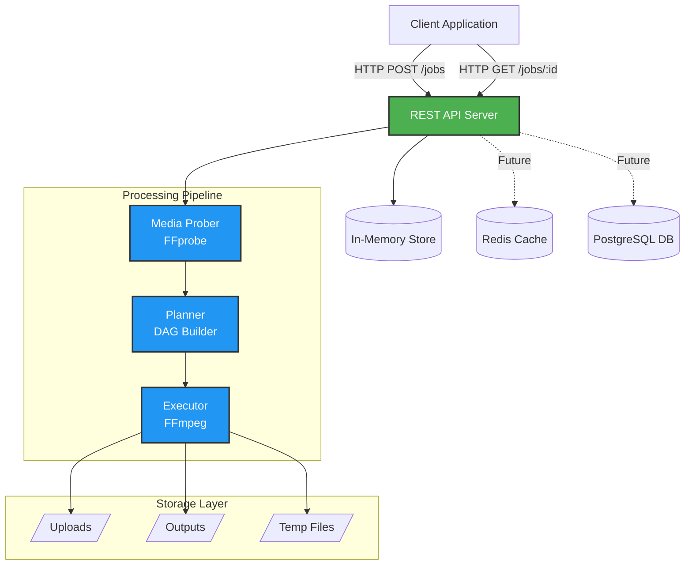
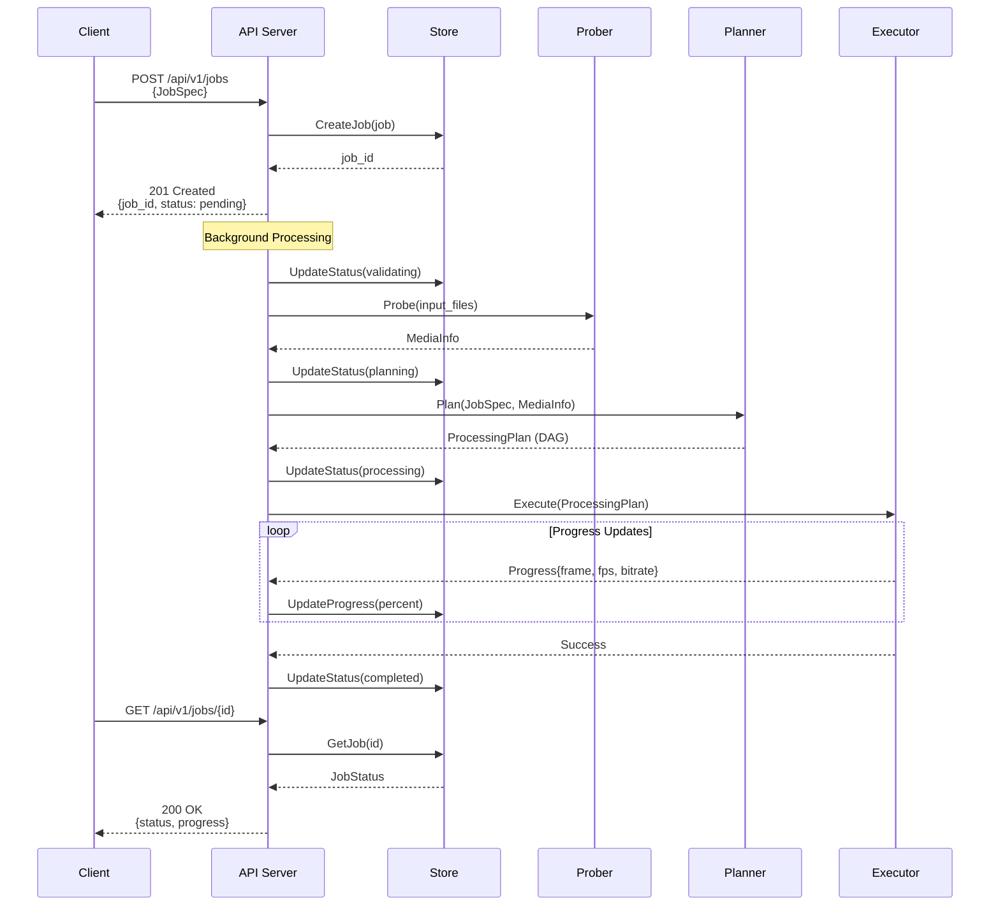
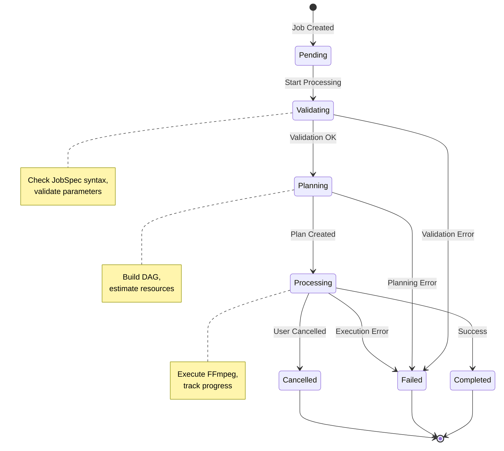

# Media Pipeline

A declarative, scalable media processing pipeline built on FFmpeg.

[中文文档](README.zh-CN.md) | [Examples](EXAMPLES.md) | [Deployment Guide](DEPLOYMENT.md)

## Overview

Media Pipeline is a production-ready engine for declarative video/audio workflows. Define what you want, not how to do it.

### Key Features

- **Declarative API**: JSON-based job specifications
- **Extensible Operators**: Built-in `trim`, `scale` + custom operator support
- **Type-Safe**: Strong validation and automatic type conversion
- **Docker Ready**: One-command deployment with Docker Compose
- **REST API**: Complete job management endpoints
- **Real-time Progress**: Track processing with live updates

## Architecture

### System Architecture



### Job Processing Flow



### Job State Machine



## Quick Start

### Docker Deployment (Recommended)

The fastest way to get started is using Docker:

```bash
# Clone the repository
git clone https://github.com/chicogong/media-pipeline.git
cd media-pipeline

# Start all services (API, Redis, PostgreSQL)
make docker-up

# Or manually:
docker-compose up -d

# Check service health
curl http://localhost:8081/health

# View logs
make docker-logs
# Or: docker-compose logs -f
```

See [DEPLOYMENT.md](DEPLOYMENT.md) for complete deployment guide including production setup, configuration, and troubleshooting.

### Development Setup

```bash
# Install dependencies
make install

# Run tests
make test

# Build API server
make build

# Run locally
make run
```

### Example: Trim and Scale Video

#### Processing DAG


#### Job Specification

```json
{
  "inputs": [
    {
      "id": "video",
      "source": "s3://bucket/input.mp4"
    }
  ],
  "operations": [
    {
      "op": "trim",
      "input": "video",
      "output": "trimmed",
      "params": {
        "start": "00:00:10",
        "duration": "00:05:00"
      }
    },
    {
      "op": "scale",
      "input": "trimmed",
      "output": "scaled",
      "params": {
        "width": 1280,
        "height": 720,
        "algorithm": "lanczos"
      }
    }
  ],
  "outputs": [
    {
      "id": "scaled",
      "destination": "s3://bucket/output.mp4",
      "codec": {
        "video": {
          "codec": "libx264",
          "preset": "medium",
          "crf": 23
        },
        "audio": {
          "codec": "aac",
          "bitrate": "128k"
        }
      }
    }
  ]
}
```

## Project Structure

```
media-pipeline/
├── cmd/api/          # API server entry point
├── pkg/
│   ├── schemas/      # JobSpec, ProcessingPlan, MediaInfo
│   ├── operators/    # Operator interface + built-in operators (trim, scale)
│   ├── planner/      # DAG builder and resource estimator
│   ├── executor/     # FFmpeg command builder and runner
│   ├── prober/       # FFprobe media metadata extraction
│   ├── store/        # In-memory job storage (thread-safe)
│   └── api/          # HTTP handlers and middleware
└── docs/plans/       # Design documents
```

## Status

**✅ MVP Complete (100%)** - Production-ready with full test coverage (>70% across all modules)

**Core Modules**:
- Schemas, Operators (trim, scale), Planner, Executor, Prober, Store, API Server
- Docker deployment with Redis & PostgreSQL
- REST API with real-time progress tracking
- Comprehensive test suite (43+ tests, 3,600+ lines)

**Future Enhancements**:
- Authentication & Authorization (API keys, JWT, RBAC)
- More Operators (loudnorm, mix, concat, overlay)
- Cloud Storage (S3, GCS, Azure)
- Distributed Workers with job queue
- Prometheus metrics & distributed tracing

## Documentation

- **[EXAMPLES.md](EXAMPLES.md)** - Practical usage examples and client SDKs
- **[DEPLOYMENT.md](DEPLOYMENT.md)** - Docker deployment, production setup, troubleshooting
- **[docs/plans/](docs/plans/)** - Detailed design documents

## Testing

```bash
# Run all tests
make test

# Run specific package tests
go test ./pkg/operators/... -v
```

## License

MIT License - see [LICENSE](LICENSE) file for details.
