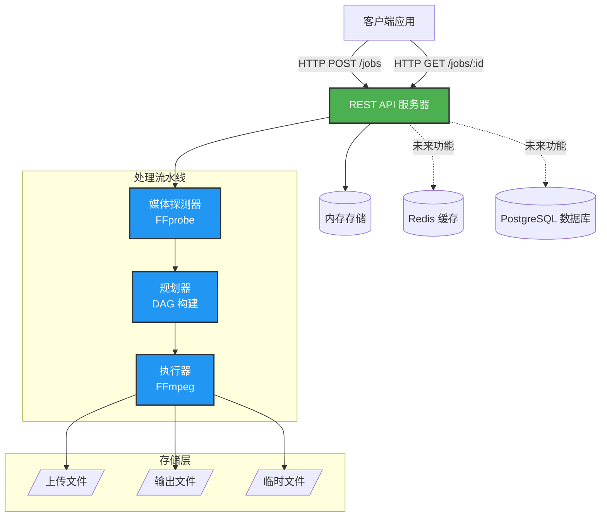
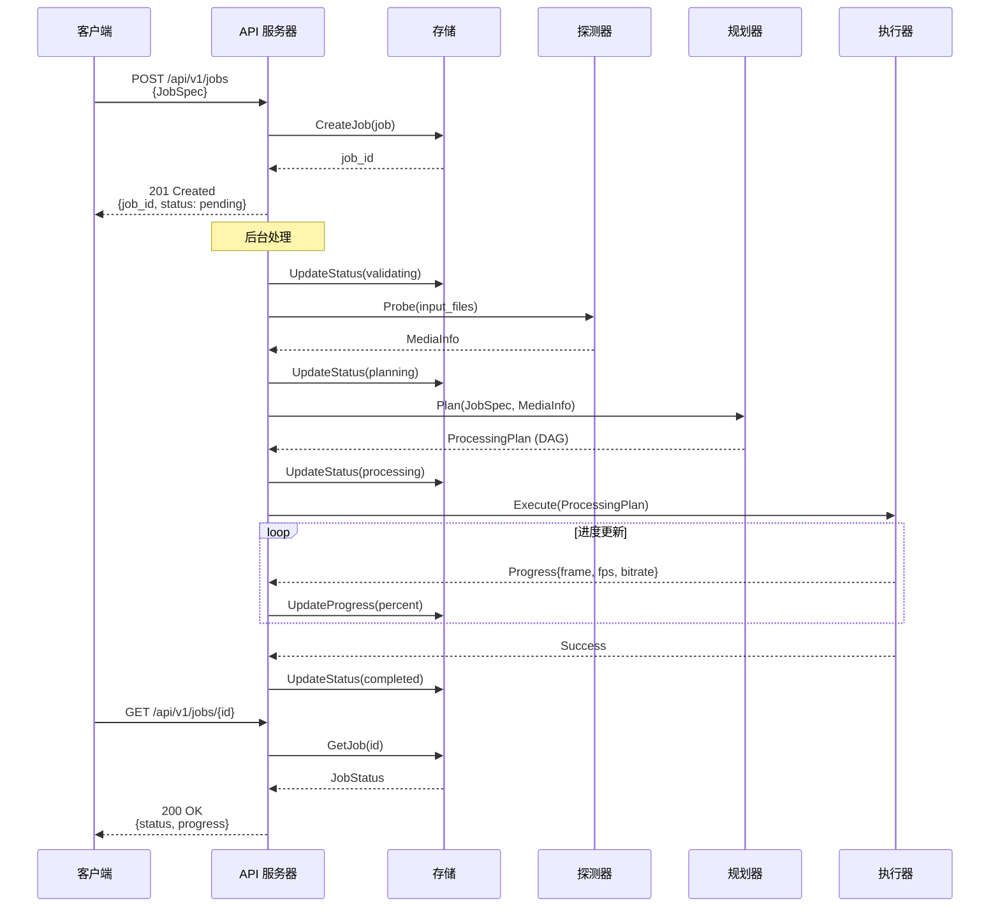
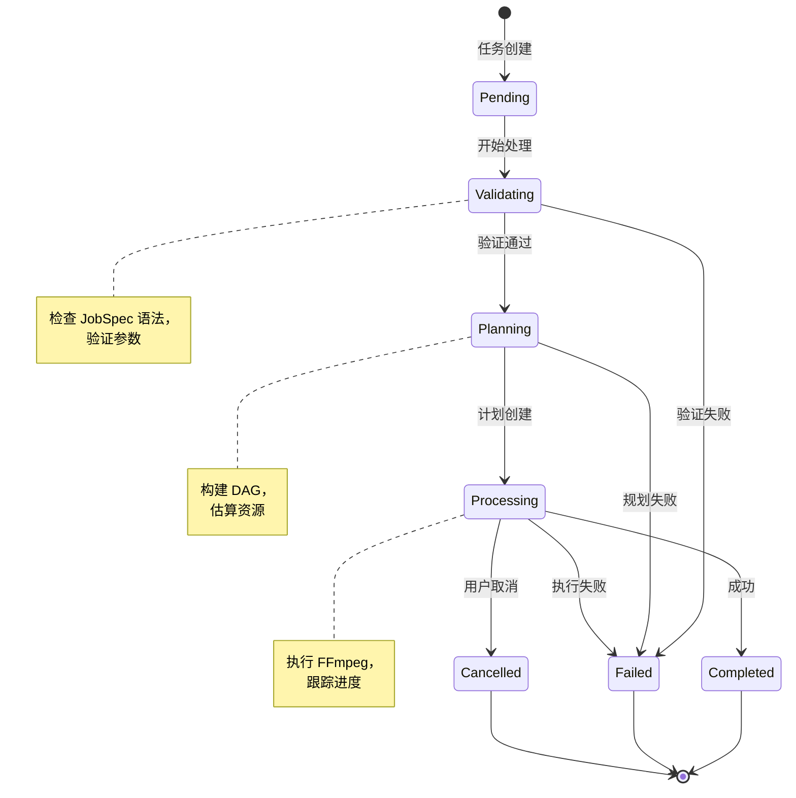

# Media Pipeline（中文）

基于 FFmpeg 的声明式、可扩展媒体处理流水线。

## 概述

Media Pipeline 面向生产环境的视频/音频处理场景，提供声明式 JobSpec（描述“做什么”，而不是“怎么做”），并将其编译为可执行的 FFmpeg 处理计划与命令。

## 主要特性

- **声明式 API**：用高层算子表达剪辑、转码与处理意图
- **算子体系**：内置算子（trim、scale、loudnorm 等）与自定义扩展
- **可分布式扩展**：多 Worker 横向扩容
- **类型安全**：参数校验与类型转换
- **可扩展**：无需修改核心即可注册新算子
- **可观测**：进度、日志、指标/链路跟踪（规划中）
- **可靠性**：错误处理、失败恢复/重试（规划中）

## 架构概览

### 系统架构



### 任务处理流程



### 任务状态机



## 快速开始

### Docker 部署（推荐）

最快的启动方式是使用 Docker：

```bash
# 克隆仓库
git clone https://github.com/chicogong/media-pipeline.git
cd media-pipeline

# 启动所有服务（API、Redis、PostgreSQL）
make docker-up

# 或手动启动：
docker-compose up -d

# 检查服务健康
curl http://localhost:8081/health

# 查看日志
make docker-logs
# 或: docker-compose logs -f
```

完整的部署指南请参考 [DEPLOYMENT.md](DEPLOYMENT.md)（包括生产环境配置、安全加固、故障排查等）。

### 开发环境设置

```bash
# 安装依赖
make install

# 运行测试
make test

# 构建 API 服务器
make build

# 本地运行
make run
```

### 示例：裁剪并缩放视频

#### 处理 DAG


#### 任务规范

```json
{
  "inputs": [
    {
      "id": "video",
      "source": "s3://bucket/input.mp4"
    }
  ],
  "operations": [
    {
      "op": "trim",
      "input": "video",
      "output": "trimmed",
      "params": {
        "start": "00:00:10",
        "duration": "00:05:00"
      }
    },
    {
      "op": "scale",
      "input": "trimmed",
      "output": "scaled",
      "params": {
        "width": 1280,
        "height": 720,
        "algorithm": "lanczos"
      }
    }
  ],
  "outputs": [
    {
      "id": "scaled",
      "destination": "s3://bucket/output.mp4",
      "codec": {
        "video": {
          "codec": "libx264",
          "preset": "medium",
          "crf": 23
        },
        "audio": {
          "codec": "aac",
          "bitrate": "128k"
        }
      }
    }
  ]
}
```

## 项目结构

```
media-pipeline/
├── cmd/
│   ├── api/          # API 服务（规划）
│   └── worker/       # Worker 进程（规划）
├── pkg/
│   ├── schemas/      # 数据结构（JobSpec、ProcessingPlan 等）
│   ├── operators/    # 算子接口与内置算子
│   ├── planner/      # DAG 构建与资源估算
│   ├── executor/     # FFmpeg 命令构建与执行
│   ├── store/        # 数据库/队列（规划）
│   └── api/          # HTTP handlers（规划）
├── internal/
│   └── config/       # 配置（规划）
└── docs/
    └── plans/        # 设计文档
```

## 实现状态

### ✅ MVP 完成（100%）

- **Schemas 包**（`pkg/schemas/`）- 4 文件，400 行
  - JobSpec、ProcessingPlan、JobStatus 数据结构
  - Duration 类型（支持 Go duration、timecode、ISO 8601）
  - MediaInfo 音视频元数据结构
  - 资源估算结构（NodeEstimates、ResourceEstimates）

- **Operators 包**（`pkg/operators/`）- 7 文件，800 行
  - Operator 接口（6 个核心方法）
  - 类型系统（11 种参数类型）
  - 参数验证框架（声明式规则）
  - 类型转换（格式间自动转换）
  - Registry 机制（全局算子注册）

- **内置算子**（`pkg/operators/builtin/`）
  - `trim` - 按时间范围裁剪视频/音频，支持灵活的时间格式
  - `scale` - 调整视频分辨率，支持算法选择（lanczos、bicubic 等）

- **Planner 模块**（`pkg/planner/`）- 13 文件，1,400 行，43 测试
  - DAG 构建与环检测
  - 拓扑排序（Kahn 算法）
  - 执行阶段计算（并行化）
  - 元数据传播
  - 资源估算（CPU、内存、磁盘）
  - 集成规划器与验证

- **Executor 模块**（`pkg/executor/`）- 7 文件，600 行，14 测试
  - 从 ProcessingPlan 构建 FFmpeg 命令
  - 实时进度解析
  - 进程执行与取消支持
  - 全面的错误处理

- **Media Prober 模块**（`pkg/prober/`）- 3 文件，500 行，6 测试
  - FFprobe 封装器，用于媒体元数据提取
  - JSON 解析与验证
  - Context 取消支持
  - 全面测试覆盖（81.7%）

- **Store 模块**（`pkg/store/`）- 4 文件，1,100 行，11 测试
  - Store 接口（持久化抽象）
  - 内存实现（线程安全）
  - CRUD 操作
  - 状态跟踪与进度更新
  - 过滤、排序、分页

- **API 服务器**（`pkg/api/`、`cmd/api/`）- 4 文件，900 行，9 测试
  - RESTful 端点（创建、获取、列表、删除任务）
  - 后台任务处理
  - 健康检查端点
  - 中间件（日志、CORS、panic 恢复）
  - 优雅关闭

- **Docker 与部署**- 7 文件，1,300 行
  - 多阶段 Dockerfile（Go + FFmpeg）
  - Docker Compose（所有服务编排）
  - 生产环境部署配置
  - 完整部署文档
  - Makefile（常用操作）

**合计**：42 文件，4,900 行代码 + 3,600 行测试

**测试覆盖率**：所有核心模块 >70% 覆盖率

### 🚀 生产就绪

- ✅ 完整的 REST API 服务器
- ✅ Docker 多服务编排部署
- ✅ 健康检查与优雅关闭
- ✅ 完整文档
- ✅ Makefile 便捷操作
- ✅ 生产环境部署指南

### 📋 未来增强

- **认证与授权** - API 密钥、JWT 令牌、RBAC
- **Webhook 通知** - 任务完成回调
- **更多算子** - loudnorm、mix、concat、overlay 等
- **云存储** - S3、GCS、Azure Blob 集成
- **分布式 Worker** - 使用任务队列的横向扩展
- **高级错误处理** - 重试策略、详细的 FFmpeg 错误解析
- **可观测性** - Prometheus 指标、分布式追踪

## 设计文档

设计文档位于 `docs/plans/`（目前以英文为主）：

1. [Architecture Design](docs/plans/2025-12-14-media-pipeline-architecture-design.md)
2. [Schemas Detailed Design](docs/plans/schemas-detailed-design.md)
3. [Planner Module Design](docs/plans/planner-detailed-design.md)
4. [Operator Interface Design](docs/plans/operator-interface-design.md)
5. [API Interface Design](docs/plans/api-interface-design.md)
6. [Distributed State Management](docs/plans/distributed-state-management-design.md)
7. [Error Handling Design](docs/plans/error-handling-design.md)

## 参与贡献

实现路线图请参考 `IMPLEMENTATION_GUIDE.md`，总体进度请参考 `PROGRESS.md`。

## 许可证

MIT License，详见 `LICENSE`。

---

**状态**：MVP 完成（100%）🎉 - 生产就绪的媒体处理流水线，包含 Docker 部署、REST API 和完整测试。所有核心模块已实现：Schemas、Operators、Planner、Executor、Prober、Store 和 API Server。
