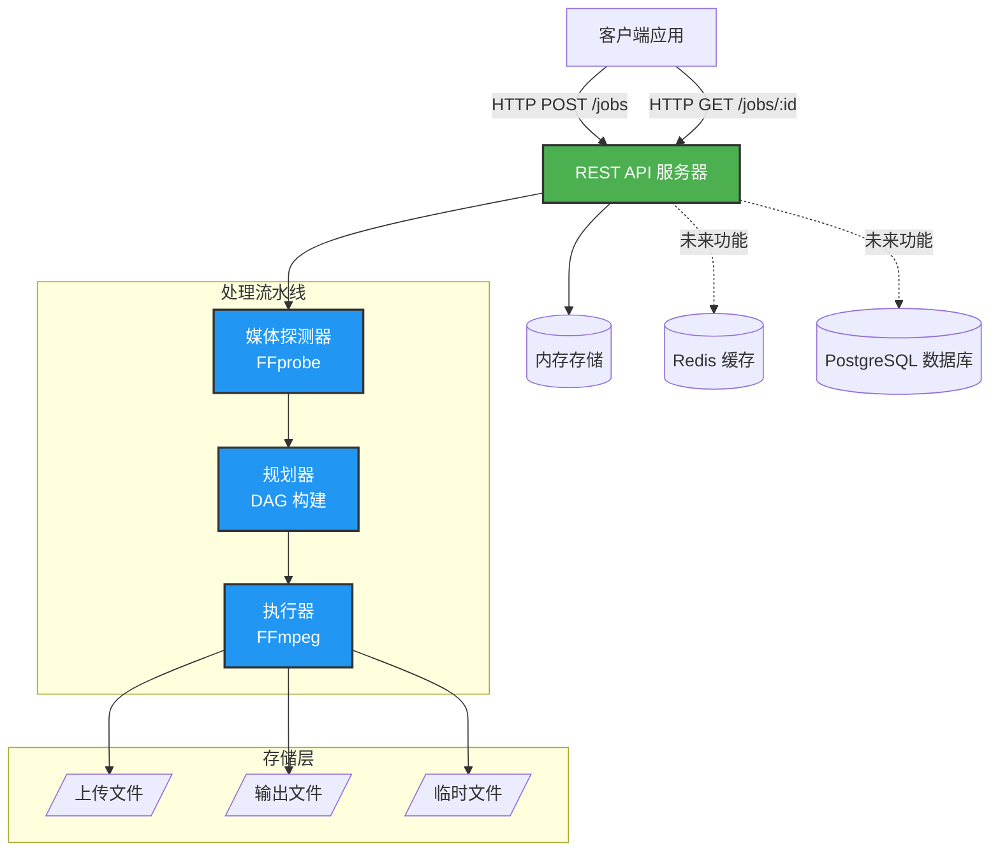
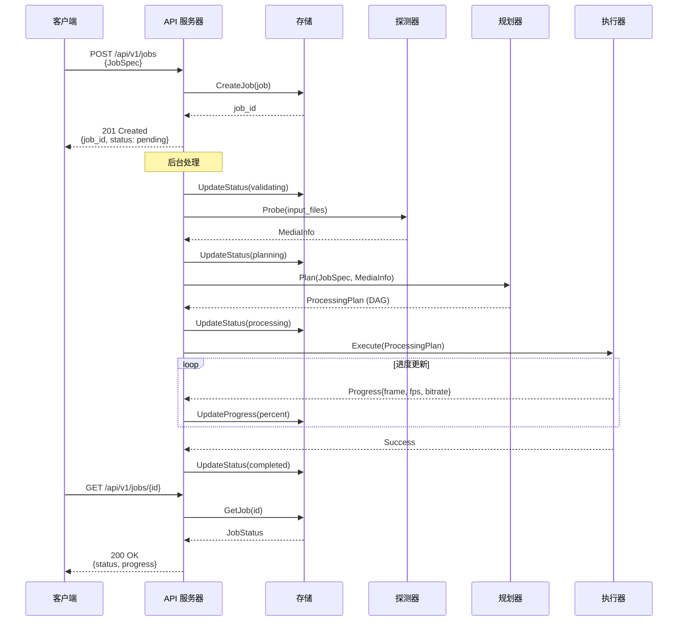
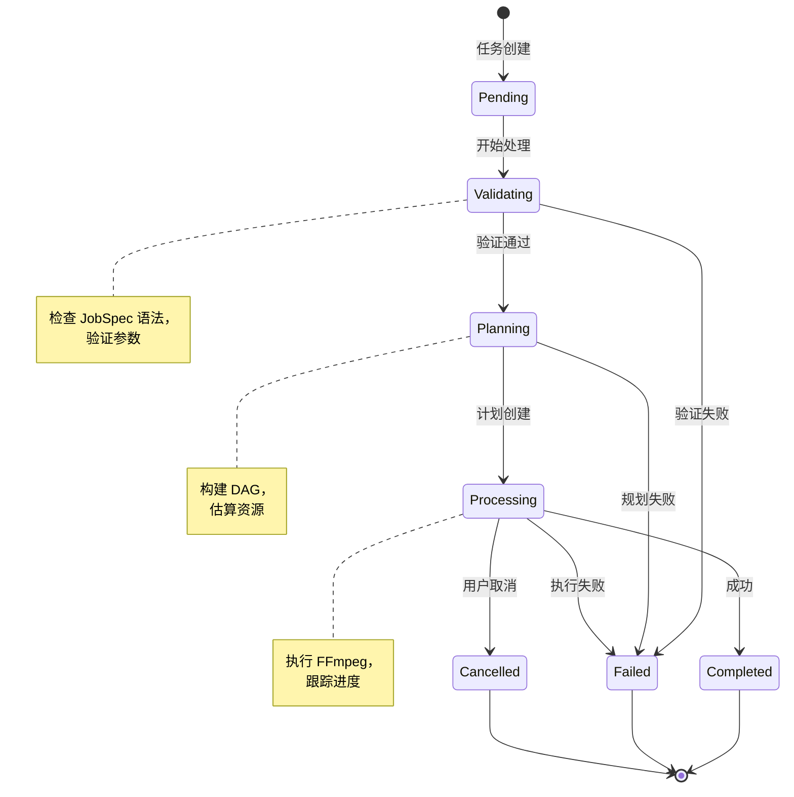

# Media Pipeline（中文）

基于 FFmpeg 的声明式、可扩展媒体处理流水线。

[English](README.md) | [示例文档](EXAMPLES.md) | [部署指南](DEPLOYMENT.md)

## 概述

Media Pipeline 是生产就绪的声明式视频/音频处理引擎。描述你想要什么，而不是如何实现。

## 主要特性

- **声明式 API**：基于 JSON 的任务规范
- **可扩展算子**：内置 `trim`、`scale` + 自定义算子支持
- **类型安全**：强校验与自动类型转换
- **Docker 就绪**：一键 Docker Compose 部署
- **REST API**：完整的任务管理端点
- **实时进度**：实时处理进度追踪

## 架构概览

### 系统架构



### 任务处理流程



### 任务状态机



## 快速开始

### Docker 部署（推荐）

最快的启动方式是使用 Docker：

```bash
# 克隆仓库
git clone https://github.com/chicogong/media-pipeline.git
cd media-pipeline

# 启动所有服务（API、Redis、PostgreSQL）
make docker-up

# 或手动启动：
docker-compose up -d

# 检查服务健康
curl http://localhost:8081/health

# 查看日志
make docker-logs
# 或: docker-compose logs -f
```

完整的部署指南请参考 [DEPLOYMENT.md](DEPLOYMENT.md)（包括生产环境配置、安全加固、故障排查等）。

### 开发环境设置

```bash
# 安装依赖
make install

# 运行测试
make test

# 构建 API 服务器
make build

# 本地运行
make run
```

### 示例：裁剪并缩放视频

#### 处理 DAG


#### 任务规范

```json
{
  "inputs": [
    {
      "id": "video",
      "source": "s3://bucket/input.mp4"
    }
  ],
  "operations": [
    {
      "op": "trim",
      "input": "video",
      "output": "trimmed",
      "params": {
        "start": "00:00:10",
        "duration": "00:05:00"
      }
    },
    {
      "op": "scale",
      "input": "trimmed",
      "output": "scaled",
      "params": {
        "width": 1280,
        "height": 720,
        "algorithm": "lanczos"
      }
    }
  ],
  "outputs": [
    {
      "id": "scaled",
      "destination": "s3://bucket/output.mp4",
      "codec": {
        "video": {
          "codec": "libx264",
          "preset": "medium",
          "crf": 23
        },
        "audio": {
          "codec": "aac",
          "bitrate": "128k"
        }
      }
    }
  ]
}
```

## 项目结构

```
media-pipeline/
├── cmd/api/          # API 服务器入口
├── pkg/
│   ├── schemas/      # JobSpec、ProcessingPlan、MediaInfo
│   ├── operators/    # 算子接口 + 内置算子（trim、scale）
│   ├── planner/      # DAG 构建与资源估算
│   ├── executor/     # FFmpeg 命令构建与执行
│   ├── prober/       # FFprobe 媒体元数据提取
│   ├── store/        # 内存任务存储（线程安全）
│   └── api/          # HTTP handlers 与中间件
└── docs/plans/       # 设计文档
```

## 实现状态

**✅ MVP 完成（100%）** - 生产就绪，全模块测试覆盖率 >70%

**核心模块**：
- Schemas、Operators（trim、scale）、Planner、Executor、Prober、Store、API Server
- Docker 部署（Redis & PostgreSQL）
- REST API 与实时进度追踪
- 完整测试套件（43+ 测试，3,600+ 行）

**未来增强**：
- 认证与授权（API 密钥、JWT、RBAC）
- 更多算子（loudnorm、mix、concat、overlay）
- 云存储（S3、GCS、Azure）
- 分布式 Worker 与任务队列
- Prometheus 指标与分布式追踪

## 文档

- **[EXAMPLES.md](EXAMPLES.md)** - 实用示例与客户端 SDK
- **[DEPLOYMENT.md](DEPLOYMENT.md)** - Docker 部署、生产配置、故障排查
- **[docs/plans/](docs/plans/)** - 详细设计文档

## 测试

```bash
# 运行所有测试
make test

# 运行特定包的测试
go test ./pkg/operators/... -v
```

## 许可证

MIT License，详见 `LICENSE`。
