# Media Pipeline（中文）

[](https://go.dev/)
[](https://ffmpeg.org/)
[](https://www.docker.com/)
[](LICENSE)

基于 FFmpeg 的声明式、可扩展媒体处理流水线。

[English](README.md) | [示例文档](EXAMPLES.md) | [部署指南](DEPLOYMENT.md)

## 概述

Media Pipeline 是生产就绪的声明式视频/音频处理引擎。描述你想要什么，而不是如何实现。

## 主要特性

- **声明式 API**：基于 JSON 的任务规范
- **可扩展算子**：内置 `trim`、`scale` + 自定义算子支持
- **类型安全**：强校验与自动类型转换
- **Docker 就绪**：一键 Docker Compose 部署
- **REST API**：完整的任务管理端点
- **实时进度**：实时处理进度追踪

## 架构概览

### 系统架构

```mermaid
graph TB
    Client[客户端应用]
    API[REST API 服务器]
    Store[(内存存储)]
    Redis[(Redis 缓存)]
    Postgres[(PostgreSQL 数据库)]

    subgraph "处理流水线"
        Prober[媒体探测器<br/>FFprobe]
        Planner[规划器<br/>DAG 构建]
        Executor[执行器<br/>FFmpeg]
    end

    subgraph "存储层"
        Uploads[/上传文件/]
        Outputs[/输出文件/]
        Temp[/临时文件/]
    end

    Client -->|HTTP POST /jobs| API
    Client -->|HTTP GET /jobs/:id| API
    API --> Store
    API -.->|未来功能| Redis
    API -.->|未来功能| Postgres

    API --> Prober
    Prober --> Planner
    Planner --> Executor

    Executor --> Uploads
    Executor --> Temp
    Executor --> Outputs

    style API fill:#4CAF50,stroke:#333,stroke-width:2px,color:#fff
    style Prober fill:#2196F3,stroke:#333,stroke-width:2px,color:#fff
    style Planner fill:#2196F3,stroke:#333,stroke-width:2px,color:#fff
    style Executor fill:#2196F3,stroke:#333,stroke-width:2px,color:#fff
```



### 任务处理流程


### 任务状态机

```mermaid
stateDiagram-v2
    [*] --> Pending: 任务创建

    Pending --> Validating: 开始处理
    Validating --> Planning: 验证通过
    Validating --> Failed: 验证失败

    Planning --> Processing: 计划创建
    Planning --> Failed: 规划失败

    Processing --> Completed: 成功
    Processing --> Failed: 执行失败
    Processing --> Cancelled: 用户取消

    Completed --> [*]
    Failed --> [*]
    Cancelled --> [*]

    note right of Validating
        检查 JobSpec 语法，
        验证参数
    end note

    note right of Planning
        构建 DAG，
        估算资源
    end note

    note right of Processing
        执行 FFmpeg，
        跟踪进度
    end note
```



## 快速开始

### Docker 部署（推荐）

最快的启动方式是使用 Docker：

```bash
# 克隆仓库
git clone https://github.com/chicogong/media-pipeline.git
cd media-pipeline

# 启动所有服务（API、Redis、PostgreSQL）
make docker-up

# 或手动启动：
docker-compose up -d

# 检查服务健康
curl http://localhost:8081/health

# 查看日志
make docker-logs
# 或: docker-compose logs -f
```

完整的部署指南请参考 [DEPLOYMENT.md](DEPLOYMENT.md)（包括生产环境配置、安全加固、故障排查等）。

### 开发环境设置

```bash
# 安装依赖
make install

# 运行测试
make test

# 构建 API 服务器
make build

# 本地运行
make run
```

### 示例：裁剪并缩放视频

#### 处理 DAG

```mermaid
graph LR
    Input[输入视频<br/>input.mp4]
    Trim[Trim 算子<br/>10s - 5min]
    Scale[Scale 算子<br/>1280x720]
    Output[输出视频<br/>output.mp4]

    Input --> Trim
    Trim --> Scale
    Scale --> Output

    style Input fill:#FFC107,stroke:#333,stroke-width:2px
    style Trim fill:#2196F3,stroke:#333,stroke-width:2px,color:#fff
    style Scale fill:#2196F3,stroke:#333,stroke-width:2px,color:#fff
    style Output fill:#4CAF50,stroke:#333,stroke-width:2px,color:#fff
```



#### 任务规范

```json
{
  "inputs": [
    {
      "id": "video",
      "source": "s3://bucket/input.mp4"
    }
  ],
  "operations": [
    {
      "op": "trim",
      "input": "video",
      "output": "trimmed",
      "params": {
        "start": "00:00:10",
        "duration": "00:05:00"
      }
    },
    {
      "op": "scale",
      "input": "trimmed",
      "output": "scaled",
      "params": {
        "width": 1280,
        "height": 720,
        "algorithm": "lanczos"
      }
    }
  ],
  "outputs": [
    {
      "id": "scaled",
      "destination": "s3://bucket/output.mp4",
      "codec": {
        "video": {
          "codec": "libx264",
          "preset": "medium",
          "crf": 23
        },
        "audio": {
          "codec": "aac",
          "bitrate": "128k"
        }
      }
    }
  ]
}
```

## 项目结构

```
media-pipeline/
├── cmd/api/              # API 服务器入口
├── pkg/
│   ├── schemas/          # JobSpec、ProcessingPlan、MediaInfo
│   ├── operators/        # 算子接口 + 内置算子（trim、scale）
│   ├── planner/          # DAG 构建与资源估算
│   ├── executor/         # FFmpeg 命令构建与执行
│   ├── prober/           # FFprobe 媒体元数据提取
│   ├── storage/          # 🆕 存储抽象（本地、HTTP/HTTPS）
│   ├── compiler/
│   │   └── validator/    # 🆕 输入验证 + SSRF 防护
│   ├── store/            # 内存任务存储（线程安全）
│   └── api/              # HTTP handlers 与中间件
└── docs/plans/           # 设计文档
```

## 实现状态

**✅ MVP 完成 + 安全增强** - 生产就绪，已加固安全性

**核心模块**：
- **Schemas** - JobSpec、ProcessingPlan、JobStatus（含验证）
- **Operators** - trim、scale + 可扩展框架
- **Planner** - DAG 构建与资源估算
- **Executor** - FFmpeg 命令生成与执行
- **Prober** - 媒体元数据提取
- **Storage** - 统一文件抽象（本地、HTTP/HTTPS、S3）🆕
- **Validator** - 输入验证 + SSRF 防护 🆕
- **Authentication** - JWT + API Key 与角色权限 🆕
- **Store** - 内存任务存储
- **API Server** - REST API 与实时进度
- **Docker** - 多服务部署就绪

**未来增强**：
- 更多算子（loudnorm、mix、concat、overlay）
- 云存储（GCS、Azure Blob）
- 分布式 Worker 与任务队列
- 高级 RBAC 策略
- Prometheus 指标与分布式追踪
- Webhook 通知

## 文档

- **[EXAMPLES.md](EXAMPLES.md)** - 实用示例与客户端 SDK
- **[DEPLOYMENT.md](DEPLOYMENT.md)** - Docker 部署、生产配置、故障排查
- **[docs/plans/](docs/plans/)** - 详细设计文档

## 测试

```bash
# 运行所有测试
make test

# 运行特定包的测试
go test ./pkg/operators/... -v
```

## 许可证

MIT License，详见 `LICENSE`。
